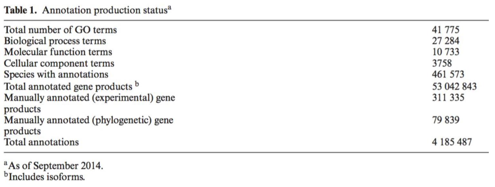

```{r setup, include=FALSE}
knitr::opts_chunk$set(echo = TRUE)
```

```{r, message=FALSE, warning=FALSE}
packages_workspace <- c("rmarkdown","knitr", "citr")
packages_data <- c("tidyverse")
packages_networks <- c("igraph", "ggraph","tidygraph", "bipartite")

packages_Lab <- c(packages_workspace,packages_data,packages_networks)
load_packages_Lab <- lapply(packages_Lab,library,character.only=TRUE)

```

# Random graphs

From [Wikipedia](https://en.wikipedia.org/wiki/Random_graph) 

> In mathematics, random graph is the general term to refer to probability distributions over graphs. Random graphs may be described simply by a probability distribution, or by a random process which generates them. The theory of random graphs lies at the intersection between graph theory and probability theory. From a mathematical perspective, random graphs are used to answer questions about the properties of typical graphs. Its practical applications are found in all areas in which complex networks need to be modeled – a large number of random graph models are thus known, mirroring the diverse types of complex networks encountered in different areas. In a mathematical context, random graph refers almost exclusively to the Erdős–Rényi random graph model. In other contexts, any graph model may be referred to as a random graph.


From [@Barabasi2015]:

To construct an undirected random network (Erdos-Renyi and Gilbert models) we follow these steps:

1. Start with N isolated nodes.
2. Select a node pair and generate a random number between 0 and 1. If the number exceeds p, connect the selected node pair with a link, otherwise leave them disconnected.
3. Repeat step (2) for each of the $N(N-1)/2$ node pairs.

```{r}

# An over-simplified version for the creation of the random graph.

n=10
p=0.2

custom_random_net <- function(n,p) {
  
  nodes=rep(1:n)
  possible_edges <- as.data.frame(t(combn(x = nodes,m = 2)))
  
  possible_edges$selected <- NA
  
  for(i in 1:nrow(possible_edges)) {
    
    random <- runif(n = 1,min = 0,max = 1)
    
    if (p > random){
      
      possible_edges[i,3] <- TRUE
      
    } else {
        
      possible_edges[i,3] <- FALSE
        
    }
    
  }

  possible_edges %>% filter(selected==TRUE) %>% dplyr::select(V1,V2) %>% graph_from_data_frame(directed = F)
  
}

my_random_net <- custom_random_net(n,p)

```


As the probability increases so does the size of the giant component.

```{r}

plots <- 10
nodes <- 100
max_prob <- 0.02
directed <- FALSE
loops <- FALSE

probability <- seq(from=0,to=max_prob, by=max_prob/plots)


for (j in 1:plots) {
  
  g <- sample_gnp(n = nodes, p = probability[j],directed = directed,loops = loops)
  g$layout <- layout_in_circle
  g$prob <- probability
  
  plot(g,layout=layout_in_circle,vertex.size=4,vertex.label=NA, vertex.color="coral2",vertex.frame.color="coral2",main = paste0("Erdos - Renyi network with ", probability[j]," probability"))
  
}


```


```{r}
## Function to create multiple random networks with different probabilities

erdos_renyi_parameters <- function(nodes,iterations,directed,loops,max_prob) {
  
  erdos_renyi_df <- data.frame(matrix(ncol = 10,nrow = iterations))
  colnames(erdos_renyi_df) <- c("nodes","giant_compontent_size","nclusters","probability","directed","loops","n_edges","mean_degree","average_clustering","average_path")
  
  probability <- seq(from=0,to=max_prob, by=max_prob/iterations)
  
  for(i in 1:iterations) {
  
    erdos_renyi <- sample_gnp(n = nodes, p = probability[i],directed = directed,loops = loops)
    
    clusters_network <- clusters(erdos_renyi)
  
    erdos_renyi_df[i,1] <- nodes
    erdos_renyi_df[i,2] <- max(clusters_network$csize)
    erdos_renyi_df[i,3] <- clusters_network$no
    erdos_renyi_df[i,4] <- probability[i]
    erdos_renyi_df[i,5] <- directed
    erdos_renyi_df[i,6] <- loops
    erdos_renyi_df[i,7] <- ecount(erdos_renyi)
    erdos_renyi_df[i,8] <- mean(igraph::degree(erdos_renyi))
    erdos_renyi_df[i,9] <- transitivity(erdos_renyi,type = "average")
    erdos_renyi_df[i,10] <- average.path.length(erdos_renyi)
    rm(clusters_network,erdos_renyi)
  
  }
  
  erdos_renyi_df
  
}

```


Run the function to see the differences that arise with the change of probability. 

```{r}
nodes <- 1000
iterations <-1000
max_prob <- 0.1
directed <- FALSE
loops <- FALSE

erdos_renyi_df <- erdos_renyi_parameters(nodes,iterations,directed,loops,max_prob)

```


Random networks expected value is determined by N and p. If we increase p a random network becomes denser: The average number of links increase linearly from ‹L› = 0 to Lmax and the average degree of a node increases from ‹k› = 0 to ‹k› = N-1 [@Barabasi2015].

$<L>=p\frac{N(N-1)}{2}$,

$<k>=p(N-1)$


```{r}
ggplot()+
  geom_point(data = erdos_renyi_df,aes(x=probability,y=n_edges), color="dodgerblue1",show.legend = F)+
  ggtitle("Erdos - Renyi networks")+
  labs(x="Probability", y= "Number of edges")+
  theme_bw()+
  theme(panel.grid.minor = element_blank(), panel.grid.major = element_blank())

```

```{r}
ggplot()+
  geom_point(data = erdos_renyi_df,aes(x=probability,y=mean_degree, color="Mean degree"),show.legend = F)+
  scale_colour_manual(values = c("Mean degree"="darkorchid2"))+
  ggtitle("Erdos - Renyi networks")+
  labs(x="probability", y= "Mean degree")+
  theme_bw()+
  theme(panel.grid.minor = element_blank(), panel.grid.major = element_blank(),legend.title = element_blank())

```

What is a phase transition? What it means in the following plot?

```{r}
ggplot()+
  geom_point(data = erdos_renyi_df,aes(x=probability,y=giant_compontent_size, color="Giant component"),show.legend = T)+
  geom_point(data = erdos_renyi_df,aes(x=probability,y=nclusters, color="Clusters"),show.legend = T)+
  scale_colour_manual(values = c("Giant component"="palegreen2","Clusters"="darkorange2"))+
  ggtitle("Erdos - Renyi networks")+
  labs(x="Probability", y= "Number")+
  theme_bw()+
  theme(panel.grid.minor = element_blank(), panel.grid.major = element_blank(),legend.title = element_blank())

```


```{r}

erdos_renyi_df %>% mutate(giant_comp_percent=giant_compontent_size/nodes) %>%
ggplot()+
  geom_point(aes(x=probability,y=giant_comp_percent, color="Giant component"),show.legend = F)+
  scale_colour_manual(values = c("Giant component"="palegreen2"))+
  ggtitle("Erdos - Renyi networks")+
  labs(x="Probability", y= expression(frac(Nodes[G],Nodes)))+
  theme_bw()+
  theme(panel.grid.minor = element_blank(), panel.grid.major = element_blank(),legend.title = element_blank())

```

```{r}

erdos_renyi_df %>% mutate(giant_comp_percent=giant_compontent_size/nodes) %>%
ggplot()+
  geom_point(aes(x=mean_degree,y=giant_comp_percent, color="Mean degree"),show.legend = F)+
  scale_colour_manual(values = c("Mean degree"="darkorchid2"))+
  ggtitle("Erdos - Renyi networks")+
  labs(x="Mean degree", y= expression(frac(Nodes[G],Nodes)))+
  theme_bw()+
  theme(panel.grid.minor = element_blank(), panel.grid.major = element_blank(),legend.title = element_blank())

```

```{r, message=FALSE, warning=FALSE}
ggplot()+
  geom_point(data = erdos_renyi_df,aes(x=probability,y=average_path), color="salmon1",show.legend = F)+
  ggtitle("Erdos - Renyi networks")+
  labs(x="Probability", y= "Average path length")+
  theme_bw()+
  theme(panel.grid.minor = element_blank(), panel.grid.major = element_blank())

```

Do a plot with the average local transitivity.

# Small-world network

Introduced by [@Watts1998]

```{r}
g <- sample_smallworld(1, 100, 5, 0.05)

```

Lattice, maximum order.

```{r}
lattice <- make_lattice(length = 100, dim = 1,nei = 2,circular = T)

plot(make_lattice(length = 4, dim = 2,nei = 1,circular = F),main="Example of lattice which is not circular")
plot(make_lattice(length = 4, dim = 2,nei = 1,circular = T),main="Example of lattice which is circular")

```

Algorithm for small-world from Wikipedia

1. Construct a regular ring lattice, a graph with N nodes each connected to K neighbors, K/2 on each side. That is, if the nodes are labeled $n_{0}\ldots n_{{N-1}}$, there is an edge $(n_{i},n_{j})$ if and only if 

${\displaystyle 0<|i-j|\ \mathrm {mod} \ \left(N-1-{\frac {K}{2}}\right)\leq {\frac {K}{2}}.}$

2. For every node $n_{i}=n_{0},\dots ,n_{{N-1}}$ take every edge connecting $n_{i}$ to its $K/2$ rightmost neighbors, that is every edge 
${\displaystyle (n_{i},n_{j}\ \mathrm {mod} \ N)}$ with 
${\displaystyle n_{i}<n_{j}\leq n_{i}+K/2}$, and rewire it with probability $\beta$. Rewiring is done by replacing
${\displaystyle (n_{i},n_{j}\ \mathrm {mod} \ N)}$ with $(n_{i},n_{k})$ where k is chosen uniformly at random from all possible nodes while avoiding self-loops $(k\neq i)$ and link duplication (there is no edge $(n_{i},n_{{k'}})$ with k'=k at this point in the algorithm).

Degrees of the lattice

```{r}
igraph::degree(lattice)
```

Average path length
```{r}
igraph::average.path.length(lattice)
```

Average local transitivity - clustering coefficient
```{r}
igraph::transitivity(graph = lattice,type = "average")

```

Comparing to the random network:

```{r}
random <- sample_gnp(n = vcount(lattice), p = 0.06,directed = F,loops = F)
igraph::average.path.length(random)
igraph::transitivity(graph = random,type = "average")
```

and the small-world network

```{r}
g <- sample_smallworld(1, 100, 5, 0.05)
igraph::average.path.length(g)
igraph::transitivity(graph = g,type = "average")
```

limitation of small world model : no scale free degree distribution.

```{r}
g <- sample_smallworld(1, 1000, 5, 0.05)
data_frame(degree=igraph::degree(g)) %>% group_by(degree) %>% summarise(n=n()) %>%
  ggplot()+
  geom_point(aes(x=degree,y=n), color="salmon1",show.legend = F)+
  ggtitle("Small-world network degree distribution")+
  theme_bw()+
  theme(panel.grid.minor = element_blank(), panel.grid.major = element_blank())
  

```


Calculate the measure of small-worldness [@Neal2017]

$\sigma ={\frac {\frac {C}{C_{r}}}{\frac {L}{L_{r}}}}$

$\omega ={\frac {L_{r}}{L}}-{\frac {C}{C_{\ell }}}$

The concept of complexity [@Strogatz2001a]. 

#### From Regular to Random.

What is the measurment of randomness?

Between Regularity and Randomness is where complexity is emerging.

# The Barabasi-Albert model

```{r}
g <- sample_pa(1000)
data_frame(degree=igraph::degree(g)) %>% group_by(degree) %>% summarise(n=n()) %>%
  ggplot()+
  geom_point(aes(x=degree,y=n), color="salmon1",show.legend = F)+
  ggtitle("Barabasi-Albert network degree distribution")+
  theme_bw()+
  theme(panel.grid.minor = element_blank(), panel.grid.major = element_blank())

```

The rich gets richer method, preferencial attachment [@Barabasi1999a]. There are other methods (some and based on natural selection) and distributions that have this scale free structure. The Matthew effect, rich gets richer and poor gets poorer, follows a log distribution.

# Dynamic systems on networks

Very nice tutorial [@Porter2016]

> When studying a dynamical process, one is concerned with its behavior as a function of time, space, and its parameters. There are numerous studies that examine how many people are infected by a biological contagion and whether it persists from one season to another, whether and to what extent interacting oscillators synchronize, whether a meme on the internet becomes viral or not, and more. These studies all have something in common: the dynamics are occurring on a set of discrete entities (the nodes in a network) that are connected to each other via edges in some nontrivial way. This leads to the natural question of how such underlying nontrivial connectivity affects dynamical processes.

> Traditional studies of continuous dynamical systems are concerned with qualitative methods to study coupled ordinary differential equations (ODEs) and/or partial differential equations (PDEs), and traditional studies of discrete dynamical systems take analogous approaches with maps.1 If the state of each node in a network is governed by its own ODE (or PDE or map), then studying a dynamical process on a network entails examining a (typically large) system of coupled ODEs (or PDEs or maps). The change in state of a node depends not only on its own current state but also on the current states of its neighboring nodes, and a network encodes which nodes interact with each other and how strongly they interact.

## Robustness

> Consider a network, and let each of its nodes be either occupied or unoccupied. One can construe occupied nodes as the operational nodes in a network, whereas unoccupied nodes are nonfunctional. We might select nodes uniformly at random and state that they are unoccupied (i.e., are effectively removed from the network) with uniform, independent probability q D 1 􏱁 p 2 Œ0; 1􏱉. This is a so- called “random attack” with an occupation probability of p (and thus an “attack probability” of 1 􏱁 p). Alternatively, we could be devious and perform some kind of “targeted attack” in which we remove (i.e., set as unoccupied) some fraction of nodes preferentially by degree (which is, by far, the most usual case considered), geodesic node betweenness centrality (a measure of how often a node occurs on short paths), location in the network, or some other network diagnostic. In the limit as the number of nodes N ! 1 in one of these processes, what fraction qc of the nodes needs to be removed so that the network no longer has a very large connected component—called a giant connected component (GCC)—of occupied nodes? A percolation transition occurs at the critical occupation probability pc D 1 􏱁 qc that indicates the point of appearance/disappearance of a GCC, which is defined as a connected network component that scales in linear proportion to N as N ! 1. 


```{r}
## function to destroy networks

destroy_net <- function(g,destroy_method) {

destroy_method <- as.character(destroy_method)
nodes <- vcount(g)

V(g)$name <- rep(x = 1:nodes)
 destroy_net_df <- data.frame(matrix(ncol = 7,nrow = nodes))
  colnames(destroy_net_df) <- c("nodes","giant_component_size","nclusters","n_edges","mean_degree","average_clustering","average_path")

if (destroy_method=="random") {
  
  for(i in 1:(nodes-1)) {
 
  delete_node<- sample(x = V(g)$name,size = 1)
  
  clusters_network <- clusters(g)

  destroy_net_df[i,1] <- vcount(g)
  destroy_net_df[i,2] <- max(clusters_network$csize)
  destroy_net_df[i,3] <- clusters_network$no
  destroy_net_df[i,4] <- ecount(g)
  destroy_net_df[i,5] <- mean(igraph::degree(g))
  destroy_net_df[i,6] <- transitivity(g,type = "average")
  destroy_net_df[i,7] <- average.path.length(g)
  
  g <- delete_vertices(graph = g,v = paste0(delete_node))
  

  }
  
} else {
  
  for(i in 1:(nodes-1)) {
 
  max_destroy_method_nodes <- as.character(V(g)[degree ==max(V(g)$degree)]$name)
  
  clusters_network <- clusters(g)
  destroy_net_df[i,1] <- vcount(g)
  destroy_net_df[i,2] <- max(clusters_network$csize)
  destroy_net_df[i,3] <- clusters_network$no
  destroy_net_df[i,4] <- ecount(g)
  destroy_net_df[i,5] <- mean(igraph::degree(g))
  destroy_net_df[i,6] <- transitivity(g,type = "global")
  destroy_net_df[i,7] <- average.path.length(g)
  
  if (length(max_destroy_method_nodes)>1) {
    
    delete_node<- sample(x = max_destroy_method_nodes,size = 1)
    g <- delete_vertices(graph = g,v = paste0(delete_node))
    
  } else {
    
    delete_node<- max_destroy_method_nodes
    g <- delete_vertices(graph = g,v = paste0(delete_node))
    
  }

  
  }
  
  }
  
  destroy_net_df
  
}


```

```{r}

# Destroy based on degree and random
g_barabasi <- sample_pa(1000)
V(g_barabasi)$degree <- igraph::degree(g)


destroy_barabasi_net_degree <- destroy_net(g_barabasi,"degree") %>% mutate(fraction_removed=nodes/max(nodes), fraction_giant_comp=giant_component_size/max(nodes))
destroy_barabasi_net_random <- destroy_net(g_barabasi,"random") %>% mutate(fraction_removed=nodes/max(nodes), fraction_giant_comp=giant_component_size/max(nodes))

# random net

g_random <- sample_gnp(n = 1000,p = 0.01,directed = F,loops = F)
V(g_random)$degree <- igraph::degree(g)


destroy_random_net_degree <- destroy_net(g_random,"degree") 


destroy_random_net_random <- destroy_net(g_random,"random") 


```

```{r}
ggplot()+
  geom_point(data = destroy_barabasi_net_degree,aes(x=nodes,y=giant_component_size, color="destroy_barabasi_net_degree"),show.legend = T)+
  geom_point(data = destroy_barabasi_net_random,aes(x=nodes,y=giant_component_size, color="destroy_barabasi_net_random"),show.legend = T)+
  geom_point(data = destroy_random_net_degree,aes(x=nodes,y=giant_component_size, color="destroy_random_net_degree"),show.legend = T)+
  geom_point(data = destroy_random_net_random,aes(x=nodes,y=giant_component_size, color="destroy_random_net_random"),show.legend = T)+
  scale_colour_manual(values = c("destroy_barabasi_net_degree"="palegreen2","destroy_barabasi_net_random"="darkorange2","destroy_random_net_degree"="orangered4","destroy_random_net_random"="steelblue3"))+
  ggtitle("Robustness")+
  labs(x="nodes", y= "fraction_giant_comp")+
  theme_bw()+
  scale_x_reverse()+
  theme(panel.grid.minor = element_blank(), panel.grid.major = element_blank(),legend.title = element_blank())


```


Modeling in networks from [@Vespignani2012], [@Barrat2008b]

> The presence of large-scale fluctuations virtually acting at all scales of the network connectivity pattern calls for a mathematical analysis where the variables characterizing each node ofthe network explicitly enter the description of the system. Unfortunately, the general solution, handling the master equation of the system, is hardly, if ever, achievable even for very simple dynamical processes. For this reason, a viable theoretical approach has to be based on techniques such as mean-field and deterministic continuum approximations, which usually provide the understanding of the basic phenomenology and phase diagram of the process under study. In both cases, the heterogeneous nature of the network- connectivity pattern is introduced by aggregating variables accord- ing to a degree-block formalism that assumes that all nodes with the same degree k are statistically equivalent. This assumption allows the grouping ofnodes in degree classes, yielding a convenient representation of the system.


# Inferring biological networks

Network represantation, deciphering biological interactions experimentally (e.g PPIs) and inferring networks using statistical methods always contain a lot of underlying assumptions. These assupmtions must be stated and meticulously examined in all levels of the analysis; starting from the experimental design until the network represantion of the system. 

Is the biologist satisfied?

How far is this network from reality, and why?


## Gene expression microarrays

Gene expression data from microarrays and RNA-seq are stored in n*m matrices. From these matrices it it possible to infer networks based on correlation methods, bayesian networks, boolean networks [@Liu2015d].

### Correlation networks

```{r, message=FALSE, warning=FALSE}
# toy data
#BiocManager::install("Biobase")

library(Biobase)
data(geneData, package = "Biobase")

# package
#install.packages("BiocManager") 
#BiocManager::install("WGCNA") 

library(WGCNA)

#https://davetang.org/muse/2012/01/31/creating-a-correlation-matrix-with-r/
```


### Bayesian networks

Nice walkthrough in r packages for the inference of bayesian networks from data [@Radhakrishnan2013].

> The task of fitting a Bayesian network is usually called learning, a term borrowed from expert systems theory and artificial intelligence. It is performed in two different steps, which correspond to model selection and parameter estimation techniques in classic statistical models.

## PPI

Integrating genetic and protein–protein interaction networks maps a functional wiring diagram of a cell [@VanderSluis2018]

## EEG

Infering networks from time series data is multiple step proccess (removal of autocorrelations, fitting ARIMA model etc) [@Kantz]. Mostly correlation methods are used but neural networks [@Silva2016] have been used also. See [@Kolaczyk2009a] for nice tutorials. For EEG and brain networks see [@Rubinov2010b].


# Strong connected

```{r, message=FALSE, warning=FALSE, eval=FALSE}

check.packages_bioconductor <- function(pkg){
    new.pkg <- pkg[!(pkg %in%library()[]$result[,1])]
    source("https://bioconductor.org/biocLite.R")
    if (length(new.pkg)) 
        biocLite(new.pkg, dependencies = TRUE)
    sapply(pkg, library, character.only = TRUE)
}


# Check installation

check_installation_bio <- check.packages_bioconductor(packages_gene_ontology_bioconductor)
#check_installation_kegg <- check.packages_bioconductor(packages_KEGG_reactome)

```

```{r, message=FALSE, warning=FALSE}
# load packages
# Previous packages

# Annotation packages

packages_gene_ontology_bioconductor <- c("AnnotationDbi","RBGL","GO.db","topGO","Rgraphviz","GSEABase")
#packages_KEGG_reactome <- c("KEGGgraph","KEGG.db","KEGGREST")

packages_Lab <- c(packages_workspace,packages_data,packages_networks,packages_gene_ontology_bioconductor)

packages_Lab_load <- lapply(packages_Lab,library,character.only=TRUE)
```


# Gene Ontology

In large scale analyses genes and/or proteins are used as statistical objects. This approach can be enriched with existing knowledge for each gene-protein in order to obtain more insightful and biologicaly relevant results. This is a way of combining knowledge from single gene/protein genetic and biochemical research with the holistic approach of big data. This unification is facilitated by Gene Ontology [@Ashburner2000c]. 

## What are ontologies

From Gruber, T. R in 1993 :

> An ontology is a description (like a formal specification of a program) of the concepts and relationships that can formally exist for an agent or a community of agents. This definition is consistent with the usage of ontology as set of concept definitions, but more general. And it is a different sense of the word than its use in philosophy.

Ontologies are a formal representation of knowledge. 


They are a very important step towards [5 star open data](https://5stardata.info/en/), linked data and the Web 3.0. The are specific languages to develop ontologies like OWL. 

From [W3C](https://www.w3.org/standards/semanticweb/)

> The term “Semantic Web” refers to W3C’s vision of the Web of linked data. Semantic Web technologies enable people to create data stores on the Web, build vocabularies, and write rules for handling data. Linked data are empowered by technologies such as RDF, SPARQL, OWL, and SKOS.

## Gene ontology content

### Structure

Gene ontology is actually 3 ontologies: Molecular function, Cellular component and Biological process. Ontologies are networks with specific structure, they are Directed Acyclic Graphs (DAGs) and not simple trees. The difference is that it is possible for classes to have multiple parents in the classifi cation hierarchy, and furthermore ontologies include additional types of relationships between entities other than hierarchical classification [@Dessimoz2017]. 


From [@Gene2015]



```{r}
BP_children <- as.list(GOBPCHILDREN)
BP_children <- BP_children[!is.na(BP_children)]


BP_children_tidy <- unlist(BP_children)

# the Biological process network
BP_children_tidy_df <- data.frame(GO.type.relation=names(BP_children_tidy),relation_GO=BP_children_tidy) %>% mutate(type.relation=gsub("(.*)\\.(.*)","\\2",GO.type.relation), GO.term=gsub("(.*)\\.(.*)","\\1",GO.type.relation)) # %>% mutate(Term=sapply(X = GO.term, FUN = Term))

BP_children_terms <- unique(c(as.character(BP_children_tidy_df$relation_GO),as.character(BP_children_tidy_df$GO.term)))

```

## Relationships

The following relations are used in Gene Ontology

* is a
* part of
* has part
* regulates
* positevely regulates

```{r}
kable(table(BP_children_tidy_df$type.relation),caption = "Biological process ontology relations")
```


Classes are arranged in a hierarchy from the general (high in the hierarchy) to the specific (low in the hierarchy).

Because of DAG structure and the relationships mentioned before reasoning and logic become possible.

## Gene ontology annotation in r

Bioconductor has packages in R that do Gene Ontology annotation in genes of many organisms with different types of database IDs. For detailed tutorials look [@Sinha2014].

```{r, message=FALSE, warning=FALSE}

# data from Biogrid
Escherichia_coli_biogrid <- read.delim(file = "Data/BIOGRID-ORGANISM-Escherichia_coli_K12_MG1655-3.5.166.mitab.txt",sep = "\t",header = T) %>% mutate(InteractorA_entrez=gsub("(.*):(.*)","\\2",X.ID.Interactor.A), InteractorB_entrez=gsub("(.*):(.*)","\\2",ID.Interactor.B))

Escherichia_coli_biogrid_proteins <- as.character(unique(c(Escherichia_coli_biogrid$InteractorA_entrez,Escherichia_coli_biogrid$InteractorB_entrez))) # gene universe

Escherichia_coli_biogrid_physical_association <- Escherichia_coli_biogrid %>% filter(Interaction.Types %in% c("psi-mi:MI:0407(direct interaction)","psi-mi:MI:0915(physical association)"))

Escherichia_coli_biogrid_physical_association_proteins <- as.character(unique(c(Escherichia_coli_biogrid_physical_association$InteractorA_entrez,Escherichia_coli_biogrid_physical_association$InteractorB_entrez))) # genes of interest

```

## Identifiers with AnnotationDPi

Organism specific.

```{r, message=FALSE, warning=FALSE,eval=FALSE}
if (!requireNamespace("BiocManager", quietly = TRUE))
    install.packages("BiocManager")
BiocManager::install("org.EcK12.eg.db", version = "3.8")
```


```{r, message=FALSE, warning=FALSE}

library(org.EcK12.eg.db)

my_map <- org.EcK12.eg.db

columns(org.EcK12.eg.db)
keys_entrez <- keys(org.EcK12.eg.db,keytype = "ENTREZID")

Escherichia_coli_ENTREZID_symbol <- AnnotationDbi::select(org.EcK12.eg.db, keys=keys_entrez, columns = c("ENTREZID","SYMBOL")) %>% mutate(PPI= ENTREZID %in% Escherichia_coli_biogrid_physical_association_proteins)

```

## Singular enrichment analysis

In order to examine which gene ontology terms are overrepresented in the genes of our network we have to do a statistic test. Most commonly used tests is the Fisher's exact test, the chi square test and the binomial test. We will use the Fisher' s exact test for the Biological Process component of Gene Ontology.


```{r, message=FALSE, warning=FALSE, echo=FALSE}

#### The data and the preparation necessary to load to topGO object.
#  # Gene Universe

mySymbols <- unlist(mget(Escherichia_coli_biogrid_physical_association_proteins, org.EcK12.egACCNUM, ifnotfound=NA))

# genes of interest

# then make a factor that is 1 if the probeset is "interesting" and 0 otherwise
geneList <- as.integer(Escherichia_coli_biogrid_proteins %in% Escherichia_coli_biogrid_physical_association_proteins)
# name the factor with the probeset names
names(geneList) <- Escherichia_coli_biogrid_proteins

# Make the topGO object with the data
sampleGOdata <- new("topGOdata", description = "Simple session", ontology = "BP", allGenes = as.factor(geneList), nodeSize = 5,annot = annFUN.org, mapping="org.EcK12.eg.db", ID="entrez")

# Run the tests
resultFisher <- runTest(sampleGOdata, algorithm = "classic", statistic = "fisher") # the p-values are not adjusted!!!!

ss <- resultFisher@score[resultFisher@score<0.01]
#resultKS <- runTest(sampleGOdata, algorithm = "classic", statistic = "ks")
#resultKS.elim <- runTest(sampleGOdata, algorithm = "elim", statistic = "ks")

############################################# Analysis of results #####################################################

# Dataframe with top GO
allRes <- GenTable(sampleGOdata, classicFisher = resultFisher, ranksOf = "classicFisher", orderBy = "classicFisher",topNodes = length(resultFisher@score))
allRes$classicFisher <- as.numeric(allRes$classicFisher)

allRes$classicFisher <- with(allRes,ifelse(is.na(classicFisher),0,classicFisher))
p <- as.numeric(allRes$classicFisher)

allRes$p_adjust_FDR <- p.adjust(p,method ="fdr",n = length(p))
allRes$p_adjust_Bonferroni <- p.adjust(p,method ="bonferroni",n = length(p))


allRes_001_sig <- allRes[as.numeric(allRes$classicFisher)<0.01,]

```

Now that we performed the test we can plot the part of the biological process ontology that is significant.

```{r}
####################################### Plot GO graph #########################################

showSigOfNodes <- showSigOfNodes(sampleGOdata, score(resultFisher), firstSigNodes = 53, useInfo = 'all')
# it induces the GO graph with the quered IDs. 
showSigOfNodes

printGraph(sampleGOdata, resultFisher, firstSigNodes = 10, useInfo = 'all',fn.prefix = "Gene Ontology enriched terms", pdfSW = TRUE)

showSigOfNodes_igraph <- graph_from_graphnel(showSigOfNodes$dag, name = TRUE, weight = TRUE,
  unlist.attrs = TRUE)

summary(showSigOfNodes_igraph)

```

```{r, message=FALSE, warning=FALSE, echo=FALSE, eval=FALSE}

ggraph(showSigOfNodes_igraph, 'igraph', algorithm = 'tree') + 
  geom_edge_link(edge_width=0.2, arrow = arrow(length = unit(0.8, 'mm')), 
                   end_cap = circle(0.8, 'mm'), aes(),colour = "steelblue") + 
  geom_node_point(size=0.5, aes(),color="red")+
  geom_node_text(aes(label = name), color = 'black', size = 3) +
  #ggtitle("GO graph of the significant terms of essential cluster")+
  theme_graph()+
  theme(text=element_text(size=10, family="Courier"))+
  theme(plot.title = element_text(size=12, vjust=1,family="Courier"))

```


All these test share the same assumption for the null hypothesis, that the probabilities for the selection of each gene are equal [@Rivals2007]. But it turns out that thay are not because the structure of gene ontology bipartite network of genes and gene terms has a heavy tail distribution and hence these tests are biased to high degree terms [@Glass2014]. 

[Nice explanation to the biases of gene ontology](http://khughitt.github.io/slidify-annotation_enrichment_analysis/#1)


# References
