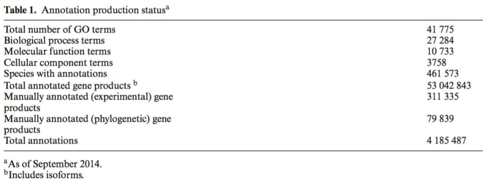

```{r setup, include=FALSE}
knitr::opts_chunk$set(echo = TRUE)
```

```{r, message=FALSE, warning=FALSE, eval=FALSE}

check.packages_bioconductor <- function(pkg){
    new.pkg <- pkg[!(pkg %in%library()[]$result[,1])]
    source("https://bioconductor.org/biocLite.R")
    if (length(new.pkg)) 
        biocLite(new.pkg, dependencies = TRUE)
    sapply(pkg, library, character.only = TRUE)
}


# Check installation

check_installation_bio <- check.packages_bioconductor(packages_gene_ontology_bioconductor)
check_installation_kegg <- check.packages_bioconductor(packages_KEGG_reactome)

```

```{r, message=FALSE, warning=FALSE}
# load packages
# Previous packages

packages_workspace <- c("rmarkdown","knitr", "citr")
packages_data <- c("tidyverse")
packages_networks <- c("igraph", "ggraph","tidygraph", "bipartite")

# Annotation packages

packages_gene_ontology_bioconductor <- c("AnnotationDbi","RBGL","GO.db","topGO","Rgraphviz","GSEABase")
packages_KEGG_reactome <- c("KEGGgraph","KEGG.db","KEGGREST")

packages_Lab <- c(packages_workspace,packages_data,packages_networks,packages_gene_ontology_bioconductor,packages_KEGG_reactome)

packages_Lab_load <- lapply(packages_Lab,library,character.only=TRUE)
```


# Gene Ontology

In large scale analyses genes and/or proteins are used as statistical objects. This approach can be enriched with existing knowledge for each gene-protein in order to obtain more insightful and biologicaly relevant results. This is a way of combining knowledge from single gene/protein genetic and biochemical research with the holistic approach of big data. This unification is facilitated by Gene Ontology [@Ashburner2000c]. 

## What are ontologies

From Gruber, T. R in 1993 :

> An ontology is a description (like a formal specification of a program) of the concepts and relationships that can formally exist for an agent or a community of agents. This definition is consistent with the usage of ontology as set of concept definitions, but more general. And it is a different sense of the word than its use in philosophy.

Ontologies are a formal representation of knowledge. 


They are a very important step towards [5 star open data](https://5stardata.info/en/), linked data and the Web 3.0. The are specific languages to develop ontologies like OWL. 

From [W3C](https://www.w3.org/standards/semanticweb/)

> The term “Semantic Web” refers to W3C’s vision of the Web of linked data. Semantic Web technologies enable people to create data stores on the Web, build vocabularies, and write rules for handling data. Linked data are empowered by technologies such as RDF, SPARQL, OWL, and SKOS.

## Gene ontology content

### Structure

Gene ontology is actually 3 ontologies: Molecular function, Cellular component and Biological process. Ontologies are networks with specific structure, they are Directed Acyclic Graphs (DAGs) and not simple trees. The difference is that it is possible for classes to have multiple parents in the classifi cation hierarchy, and furthermore ontologies include additional types of relationships between entities other than hierarchical classification [@Dessimoz2017]. 


From [@Gene2015]



```{r}
BP_children <- as.list(GOBPCHILDREN)
BP_children <- BP_children[!is.na(BP_children)]


BP_children_tidy <- unlist(BP_children)

# the Biological process network
BP_children_tidy_df <- data.frame(GO.type.relation=names(BP_children_tidy),relation_GO=BP_children_tidy) %>% mutate(type.relation=gsub("(.*)\\.(.*)","\\2",GO.type.relation), GO.term=gsub("(.*)\\.(.*)","\\1",GO.type.relation)) # %>% mutate(Term=sapply(X = GO.term, FUN = Term))

BP_children_terms <- unique(c(as.character(BP_children_tidy_df$relation_GO),as.character(BP_children_tidy_df$GO.term)))

```

## Relationships

The following relations are used in Gene Ontology

* is a
* part of
* has part
* regulates
* positevely regulates

```{r}
kable(table(BP_children_tidy_df$type.relation),caption = "Biological process ontology relations")
```


Classes are arranged in a hierarchy from the general (high in the hierarchy) to the specific (low in the hierarchy).

Because of DAG structure and the relationships mentioned before reasoning and logic become possible.

## Gene ontology annotation in r

Bioconductor has packages in R that do Gene Ontology annotation in genes of many organisms with different types of database IDs. For detailed tutorials look [@Sinha2014].

```{r, message=FALSE, warning=FALSE}

# data from Biogrid
Escherichia_coli_biogrid <- read.delim(file = "Data/BIOGRID-ORGANISM-Escherichia_coli_K12_MG1655-3.5.166.mitab.txt",sep = "\t",header = T) %>% mutate(InteractorA_entrez=gsub("(.*):(.*)","\\2",X.ID.Interactor.A), InteractorB_entrez=gsub("(.*):(.*)","\\2",ID.Interactor.B))

Escherichia_coli_biogrid_proteins <- as.character(unique(c(Escherichia_coli_biogrid$InteractorA_entrez,Escherichia_coli_biogrid$InteractorB_entrez))) # gene universe

Escherichia_coli_biogrid_physical_association <- Escherichia_coli_biogrid %>% filter(Interaction.Types %in% c("psi-mi:MI:0407(direct interaction)","psi-mi:MI:0915(physical association)"))

Escherichia_coli_biogrid_physical_association_proteins <- as.character(unique(c(Escherichia_coli_biogrid_physical_association$InteractorA_entrez,Escherichia_coli_biogrid_physical_association$InteractorB_entrez))) # genes of interest

```

## Identifiers with AnnotationDPi

Organism specific.

```{r, message=FALSE, warning=FALSE,eval=FALSE}
if (!requireNamespace("BiocManager", quietly = TRUE))
    install.packages("BiocManager")
BiocManager::install("org.EcK12.eg.db", version = "3.8")
```


```{r, message=FALSE, warning=FALSE}

library(org.EcK12.eg.db)

my_map <- org.EcK12.eg.db

columns(org.EcK12.eg.db)
keys_entrez <- keys(org.EcK12.eg.db,keytype = "ENTREZID")

Escherichia_coli_ENTREZID_symbol <- AnnotationDbi::select(org.EcK12.eg.db, keys=keys_entrez, columns = c("ENTREZID","SYMBOL")) %>% mutate(PPI= ENTREZID %in% Escherichia_coli_biogrid_physical_association_proteins)

```

## Singular enrichment analysis

In order to examine which gene ontology terms are overrepresented in the genes of our network we have to do a statistic test. Most commonly used tests is the Fisher's exact test, the chi square test and the binomial test. We will use the Fisher' s exact test for the Biological Process component of Gene Ontology.


```{r, message=FALSE, warning=FALSE, echo=FALSE}

#### The data and the preparation necessary to load to topGO object.
#  # Gene Universe

mySymbols <- unlist(mget(Escherichia_coli_biogrid_physical_association_proteins, org.EcK12.egACCNUM, ifnotfound=NA))

# genes of interest

# then make a factor that is 1 if the probeset is "interesting" and 0 otherwise
geneList <- as.integer(Escherichia_coli_biogrid_proteins %in% Escherichia_coli_biogrid_physical_association_proteins)
# name the factor with the probeset names
names(geneList) <- Escherichia_coli_biogrid_proteins

# Make the topGO object with the data
sampleGOdata <- new("topGOdata", description = "Simple session", ontology = "BP", allGenes = as.factor(geneList), nodeSize = 5,annot = annFUN.org, mapping="org.EcK12.eg.db", ID="entrez")

# Run the tests
resultFisher <- runTest(sampleGOdata, algorithm = "classic", statistic = "fisher") # the p-values are not adjusted!!!!

ss <- resultFisher@score[resultFisher@score<0.01]
#resultKS <- runTest(sampleGOdata, algorithm = "classic", statistic = "ks")
#resultKS.elim <- runTest(sampleGOdata, algorithm = "elim", statistic = "ks")

############################################# Analysis of results #####################################################

# Dataframe with top GO
allRes <- GenTable(sampleGOdata, classicFisher = resultFisher, ranksOf = "classicFisher", orderBy = "classicFisher",topNodes = length(resultFisher@score))
allRes$classicFisher <- as.numeric(allRes$classicFisher)

allRes$classicFisher <- with(allRes,ifelse(is.na(classicFisher),0,classicFisher))
p <- as.numeric(allRes$classicFisher)

allRes$p_adjust_FDR <- p.adjust(p,method ="fdr",n = length(p))
allRes$p_adjust_Bonferroni <- p.adjust(p,method ="bonferroni",n = length(p))


allRes_001_sig <- allRes[as.numeric(allRes$classicFisher)<0.01,]

```

Now that we performed the test we can plot the part of the biological process ontology that is significant.

```{r}
####################################### Plot GO graph #########################################

showSigOfNodes <- showSigOfNodes(sampleGOdata, score(resultFisher), firstSigNodes = 53, useInfo = 'all')
# it induces the GO graph with the quered IDs. 
showSigOfNodes

printGraph(sampleGOdata, resultFisher, firstSigNodes = 10, useInfo = 'all',fn.prefix = "Gene Ontology enriched terms", pdfSW = TRUE)

showSigOfNodes_igraph <- graph_from_graphnel(showSigOfNodes$dag, name = TRUE, weight = TRUE,
  unlist.attrs = TRUE)

summary(showSigOfNodes_igraph)

```

```{r, message=FALSE, warning=FALSE, echo=FALSE}
ggraph(showSigOfNodes_igraph, 'igraph', algorithm = 'tree') + 
  geom_edge_link(edge_width=0.2, arrow = arrow(length = unit(0.8, 'mm')), 
                   end_cap = circle(0.8, 'mm'), aes(),colour = "steelblue") + 
  geom_node_point(size=0.5, aes(),color="red")+
  geom_node_text(aes(label = name), color = 'black', size = 3) +
  #ggtitle("GO graph of the significant terms of essential cluster")+
  theme_graph()+
  theme(text=element_text(size=10, family="Courier"))+
  theme(plot.title = element_text(size=12, vjust=1,family="Courier"))

```


All these test share the same assumption for the null hypothesis, that the probabilities for the selection of each gene are equal [@Rivals2007]. But it turns out that thay are not because the structure of gene ontology bipartite network of genes and gene terms has a heavy tail distribution and hence these tests are biased to high degree terms [@Glass2014]. 

[Nice explanation to the biases of gene ontology](http://khughitt.github.io/slidify-annotation_enrichment_analysis/#1)


# References

