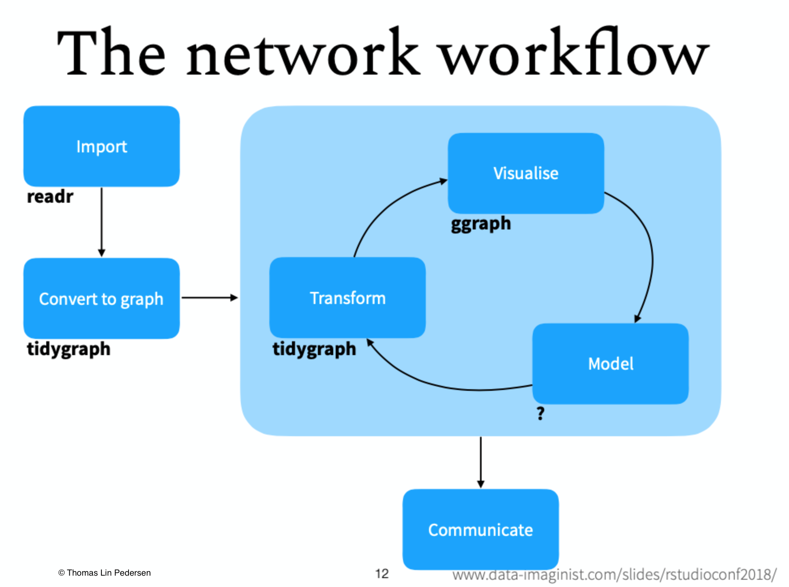
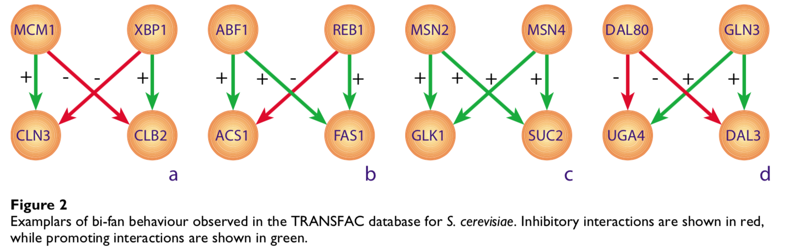
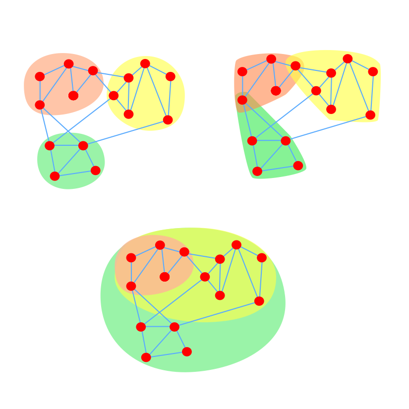
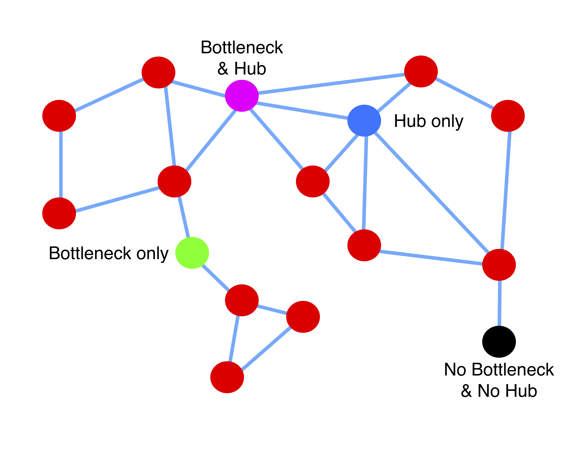

# Welcome

The aim of this workshop is to learn the basic concepts of network science and the biological applications. More importantly we will try to make this workshop useful and practical to enrich your current or future work with the different perspective of networks.

Questions

* What conceptually interests you in biology - science in general?
* Do you currently participate in a scientific project?


> The goal of this first lab is to become able to define a real network and to perform the basic steps of the workflow of network analysis.

# Workspace - Workflow

## Enviroment

[RStudio](https://www.rstudio.com/products/RStudio/) will be our working environment. 

[R Markdown](https://rmarkdown.rstudio.com) will be used for the lab and exercises because it combines literate programming with reproducible analysis [@Xie2018].

[Tidyverse](https://www.tidyverse.org) packages will be our primary grammar for data import, manipulation and plotting [@Wickham2017a].

## Network packages

There are many packages for network analysis that have overlapping functionality, like `statnet`, `sna`, `network`, `RBGL` and `igraph`. We will use `igraph` and the new package `tidygraph` for the workshop. `tidygraph` brings the "tidy" approach of `tidyverse` to network science using most of `igraph`'s code.[@Barabasi1999a]

> igraph is a collection of network analysis tools with the emphasis on efficiency, portability and ease of use. igraph is open source and free. igraph can be programmed in R, Python and C/C++.


```{r}
# Packages
packages_workspace <- c("rmarkdown","knitr")
packages_data <- c("tidyverse")
packages_networks <- c("igraph", "ggraph","tidygraph")

packages_Lab_1 <- c(packages_workspace,packages_data,packages_networks)
```


```{r, message=FALSE, warning=FALSE, eval=FALSE}

# Check installed packages and install which are missing. Check.packages function: install and load multiple R #packages. https://gist.github.com/smithdanielle/9913897
check.packages_cran <- function(pkg){
    new.pkg <- pkg[!(pkg %in% installed.packages()[, "Package"])]
    if (length(new.pkg)) 
        install.packages(new.pkg, dependencies = TRUE)
    sapply(pkg, library, character.only = TRUE)
}
check_installation_lab_1 <- check.packages_cran(packages_Lab_1)

#check.packages_bioconductor <- function(pkg){
#    
#    if (!requireNamespace("BiocManager"))
#    install.packages("BiocManager")
#    new.pkg <- pkg[!(pkg %in%library()[]$result[,1])]
#    if (length(new.pkg)) 
#        BiocManager::install(new.pkg,version = "3.8")
#    sapply(pkg, library, character.only = TRUE)
#}

# Check installation
#check_installation_bio <- check.packages_bioconductor(packages_gene_ontology_bioconductor)

```

```{r, message=FALSE, warning=FALSE}
# Load them into R session

load_packages_Lab_1 <- lapply(packages_Lab_1,library,character.only=TRUE)
```




The network data analysis workflow is the same as the workflow in data science. What differentiates network science is the tools, data structures and most importantly some novel conceptual frameworks of system analysis.

# Networks basics


## Graphs

In page 5 of [@Crane2018]:
> Networks are not graphs. A graph is a mathematical object consisting of a set of vertices V and a set of edges E cat("$\\subseteq$") V×V . This mathematical concept can be extended in several ways to allow for multiple edges, hyperedges, and multiple layers, but all of these objects, i.e., graphs, multigraphs, hypergraphs, multilayer graphs, etc., are mathematical entities. They are also distilled entities, in that they can be discussed independently of any presumed statistical or scientific context. From this point of view, graphs can be regarded as a ‘syntax’ for communicating about network data. But this graph-theoretic syntax is just one language with which to communicate about networks. 

Definition: one mode networks as graphs

We consider a directed, simple network $$G(V,E)$$ with a set of $$N$$ nodes $$V$$ and an ordered set of edges $$E$$.

**Assumptions** 

1. Nodes belong to the same variable
2. Edges belong to the same variable
3. Edges connect two nodes, **binary relation**
4. Nodes and edges are time-independent

Graphs are the mathematical - abstract representation of networks. Networks can be considered as graphs where nodes and edges are derived from data.

## Data structures

A network can be represented by 

1. **Adjacency matrix**
2. **Edgelist**
3. *Incidence matrix*

In the adjacency matrix, the edge direction is defined from row to column and is asymmetrical. In contrast, the undirected networks the adjacency matrix is symmetric. In case there are loops are noted in the diagonal.

```{r, message=FALSE, warning=FALSE}
# create a matrix

n_nodes <- 5

adjacency_matrix <- matrix(sample(c(0,1),replace = T,size = n_nodes*n_nodes),nrow = n_nodes,ncol = n_nodes,dimnames = list(letters[1:n_nodes],letters[1:n_nodes]))

network_matrix <- graph_from_adjacency_matrix(adjacency_matrix)

kable(adjacency_matrix, caption = "Adjacency matrix")

plot(network_matrix)

```


Another data structure the represents a network is the edge list. Edge lists are more "tidy" than adjacency matrices and they save space since they contain only the existent links.

```{r, message=FALSE, warning=FALSE}
edgelist <- cbind(from=letters[c(row(adjacency_matrix))], to=letters[c(col(adjacency_matrix))], value=c(adjacency_matrix))

edgelist <- edgelist[edgelist[,3]>0,]
kable(edgelist, caption = "The edgelist from the same network")


network_edgelist <- graph_from_edgelist(edgelist[,1:2])
plot(network_edgelist)

adjacency_matrix_d <- as.data.frame(adjacency_matrix,row.names = T)
```

Apart from directed, links can also be weighted, meaning they can contain values. In this example links have a variable called "weights" that is $$>0$$. Networks that have edge weights are called *weighted* and are a more general form of networks. Weights can be signed and in that case we have the *signed networks*. Signed networks are still challenging because most of the tools of graph theory and network science are compatible with non-negative matrices. 

```{r, message=FALSE, warning=FALSE}
edgelist_df <- as.data.frame(edgelist)

# links can be weighted

edgelist_df <- edgelist_df %>% mutate(weights=runif(nrow(.)))

nodes_demo <- unique(c(edgelist_df$from,edgelist_df$to)) 

kable(edgelist_df)

```


Heatmap
```{r}
ggplot() +
  geom_tile(data = edgelist_df, aes(x = to, y = fct_rev(from),fill = weights), show.legend = T) +
  labs(x="To",y="From",title = "Heatmap") +
  scale_x_discrete(position = "top") +
  coord_fixed()+
  theme_bw()
```

`igraph` package has some advanced plotting options to make highly customisable and impressive network plots, see more in `igraph.plotting`. In this workshop we will use `ggraph` which uses the same principles and syntax as `ggplot2`. 

# Real networks

When using real data is very important to determine the nature of the link, what it represents. Because with the same set of nodes there are many possible links and therefore many different networks.

There are many databases with real biological networks.

1. [BioGRID](https://thebiogrid.org)
2. [Network Repository](http://networkrepository.com/)
3. [STRING](https://string-db.org/)
4. [SNAP](https://snap.stanford.edu/)

## Protein - Protein interactions

```{r}
### for windows users please modify the path accordingly
Escherichia_coli_biogrid <- read.delim(file = "Data/BIOGRID-ORGANISM-Escherichia_coli_K12_W3110-3.5.165.mitab.txt",sep = "\t",header = T)

colnames(Escherichia_coli_biogrid)

```

```{r}
Escherichia_coli_biogrid_interaction <- Escherichia_coli_biogrid %>% group_by(Interaction.Types,Interaction.Detection.Method) %>% summarise(total_interactions=n())

kable(Escherichia_coli_biogrid_interaction,caption = "Types of interactions of Escherichia coli from BioGRID")
```


```{r}
Escherichia_coli_biogrid_physical_association <- Escherichia_coli_biogrid %>% filter(Interaction.Types %in% c("psi-mi:MI:0407(direct interaction)","psi-mi:MI:0915(physical association)"))

Escherichia_coli_biogrid_PPI_net <- Escherichia_coli_biogrid_physical_association %>% dplyr::select(Alt.IDs.Interactor.A,Alt.IDs.Interactor.B) %>% as_tbl_graph(.,directed = FALSE)

Escherichia_coli_biogrid_PPI_net_igraph <- Escherichia_coli_biogrid_physical_association %>% dplyr::select(Alt.IDs.Interactor.A,Alt.IDs.Interactor.B)


Escherichia_coli_biogrid_PPI_net_igraph_n <- graph_from_data_frame(Escherichia_coli_biogrid_PPI_net_igraph,directed = F)
```


Genetic interactions [@Boucher2013a]

> A genetic interaction (GI) between two genes generally indicates that the phenotype of a double mutant differs from what is expected from each individual mutant. The existence of a GI between two genes does not necessarily imply that these two genes code for interacting proteins or that the two genes are even expressed in the same cell. In fact, a GI only implies that the two genes share a functional relationship. These two genes may be involved in the same biological process or pathway; or they may also be involved in compensatory pathways with unrelated apparent function

see [@Boone2007a] for a nice review. 

```{r}
Escherichia_coli_biogrid_genetic <- Escherichia_coli_biogrid %>% filter(Interaction.Types %in% c("psi-mi:MI:0794(synthetic genetic interaction defined by inequality)","psi-mi:MI:0796(suppressive genetic interaction defined by inequality)","psi-mi:MI:0799(additive genetic interaction defined by inequality)"))

```

[The yeast map of genetic interactions](http://thecellmap.org) using data from [@Costanzo2016].

Are genetic interactions directed?


## Neuronal

Here we will import the *C. elegans* frontal neuronal network from the [SNAP Library](https://snap.stanford.edu/data/C-elegans-frontal.html). Other more updated and richer data can be found in [@Varshney2011]. 

**Nodes** are the rostral ganglia neurons of *C. elegans* and **links** are their synapses. The signal flow between neurons is directed.

```{r, message=FALSE, warning=FALSE}
# import files
c_elegans_edgelist <- read.delim(file = "Data/C-elegans-frontal.txt",sep = " ",header = T) %>% mutate( FromNodeId=as.character(FromNodeId),ToNodeId=as.character(ToNodeId))

c_elegans_metadata <- read_csv(file = "Data/C-elegans-frontal-meta.csv",col_names = T) %>% dplyr::rename(x=posx ,y=posy)

c_elegans_metadata$node_id <- as.character(c_elegans_metadata$node_id)

#create a igraph object
c_elegans_net <- graph_from_data_frame(d = c_elegans_edgelist,directed = T,vertices = c_elegans_metadata)

# Summarise
summary(c_elegans_net)
```

This network is also a spatial planar network because it contains the two-dimensional position of each neuron. These co-ordinations were algorithmically inferred [@Kaiser2006]. 

```{r, message=FALSE, warning=FALSE}
ggraph(graph = c_elegans_net,x = x, y = y)+
  geom_edge_link(edge_width=0.3,colour="gray50",arrow = arrow(length = unit(4, 'mm')), end_cap = circle(3, 'mm')) + 
  geom_node_point(size=1)+
  geom_point(data = c_elegans_metadata,aes(x=x,y=y),color="red")+
  theme_bw()+
  theme(panel.grid.minor = element_blank(), panel.grid.major = element_blank())

```

Before we perform network analysis is important to understand some basic structural properties of the network. Starting with the elements of the network it is important to answer these questions:

1. How many nodes?
```{r}
vcount(c_elegans_net)
```

2. How many links and what they represent?
```{r}
ecount(c_elegans_net)
```
3. Are the links directed?
```{r}
igraph::is_directed(c_elegans_net)
```
4. Are there any loops and/or multiple links? If yes why? What they mean? Are they biologically relevant?
```{r}
is_simple(c_elegans_net)
any_multiple(c_elegans_net)
```
5. Are the links weighted?

```{r}
igraph::is_weighted(c_elegans_net)

```

Then we can study the whole network.

6. Is the network connected? If not what is the size of each component?
```{r}
is_connected(c_elegans_net)
igraph::components(c_elegans_net) # if there are multiple network components sometimes is useful to use onle the giant component. To extract the giant component you can use the decompose.graph function.

decg<-decompose(c_elegans_net, min.vertices = 10)

c_elegans_net_deg <- decg[[1]]
```

A graph is connected if information can flow from each node to all the other nodes of the network. A graph can be disconnected if it has distinct components. Also directed networks is possible to be disconnected even though is only one cluster because the direction of the edges doesn't allow the flow from some nodes to some others. 

# Network metrics 

There are three levels of Network metrics, the global metrics that consider the network as a whole, local metrics that define the importance and properties of a node and the intermediate level in which nodes are grouped in subgraphs.

For this part we will use the package `tidygraph` which uses the mature `igraph` library into an interface that converts easily the graph to a `tibble` and is fully compatible with the syntax of `tidyverse`. 

```{r}
#load C. elegans network to tidygraph

c_elegans_tidy_graph <- as_tbl_graph(c_elegans_edgelist,directed = T) %>% activate(nodes) %>% left_join(c_elegans_metadata, by=c("name"="node_id"))
```


## Global network metrics

#### Density

Number of possible edges in an undirected graph g with n nodes:

$$\binom{n}{2}=\frac{n!}{(n-2)!2!} = \frac{n(n-1)}{2}$$

A complete graph is the graph that has all possible edges.

The density of a graph is the ratio of the number of edges and the number of possible edges.

for undirected graphs
$$d=\frac{number\ of\ edges}{number\ of\ possible\ edges}=\frac{2e}{n(n-1)}$$

for directed graphs
$$d=\frac{number\ of\ edges}{number\ of\ possible\ edges}=\frac{e}{n(n-1)}$$

*C. elegans* neuronal network has density:

```{r}
edge_density(c_elegans_net,loops = F)
```

see [@Wasserman1994] for more. Most real networks are sparse because they have low density.

#### Reciprocity
In directed networks some times there are reciprocal links, two links between two nodes but with opposite directions. In neuronal networks the mutuality between neurons is biological relevant.

```{r, message=FALSE, warning=FALSE}
# find the reciprocal links in the edgelist
c_elegans_edgelist_unique <- c_elegans_edgelist %>% group_by(FromNodeId,ToNodeId) %>% mutate(n=n(), From_To=
  paste0(FromNodeId,",",ToNodeId), To_From=paste0(ToNodeId,",",FromNodeId)) %>% ungroup() %>% mutate(reverse_links=From_To %in% To_From)

```

There is a simple metric to measure this property and is called reciprocity.

\begin{equation}
\label{reciprocity}
r=\frac{L\longleftrightarrow}{L},
\end{equation}

```{r}
r <- length(which(c_elegans_edgelist_unique$reverse_links==TRUE))/nrow(c_elegans_edgelist_unique)
r
```

or in igraph
```{r}
reciprocity(c_elegans_net)
```

Measuring reciprocity has been improved in the paper [@Garlaschelli2004] in which the authors explain it's importance.

> First, if the network supports some propagation process [such as the spreading of viruses in email networks or the iterative exploration of Web pages in the World Wide Web, then the presence of mutual links will clearly speed up the process and increase the possi- bility of reaching target vertices from an initial one. By contrast, if the network mediates the exchange of some good, such as wealth in the World Trade Web or nutrients in food webs then any two mutual links will tend to balance the flow determined by the presence of each other. 

This example of the *C. elegans* network and reciprocity was made not for the importance of reciprocity as a network measure but as an example of the meaning of data and their biological implications.

#### Path and walk

From page 105 from [@Wasserman1994] 

> A walk is a sequence of nodes and lines, starting and ending with nodes, in which each node is incident·with the lines following and preceding it in the sequence.

> A path is a walk in which all nodes and all lines are distinct.

The length of a path is it's number of edges. 

Graph theory and network science make extensive use of the shortest path (or geodesic) between nodes. There are many algorithms that find the shortest paths of a network but the most used is Dijkstra's. 

The diameter of a graph is the length of the longest shortest path.

```{r}
diameter(c_elegans_net)
```

The average path length is the mean geodesic.

```{r}
mean_distance(c_elegans_net)
```


```{r, message=FALSE, warning=FALSE}

c_elegans_tidy_graph <- c_elegans_tidy_graph %>% mutate(radius=graph_radius(mode = "all"), girth=graph_girth(), n_edges=graph_size(), reciprocity=graph_reciprocity(), mean_dist=graph_mean_dist())


```

## Intermediate level network analysis - Mesoscale

### Motifs


> The “network motifs” are those patterns for which the probability P of appearing in a randomized network an equal or greater number of times than in the real network is lower than a cutoff value [@Milo2002]


> A [network motif](https://en.wikipedia.org/wiki/Network_motif) in the sense introduced by Alon and co- workers is a pattern or small sub-graph that occurs more often (at some statistically significant level) in the true network than in an ensemble of networks generated by randomly rewiring the edges in the true network, where the number of nodes and the degree of each node is kept fixed [@Ingram2006a]. 

```{r}
motifs(c_elegans_net, 3)

count_motifs(c_elegans_net, 3)

count_motifs(c_elegans_net, 4)
```

They have been used in brain networks, gene regulation networks as well as metabolic networks. 
Currently there isn't a function in `igraph` to automate the statistical test of motifs.

* bi-fan
* feed forward loop
* etc

Find the statistically significant motifs.

Structural balance analysis of signed graphs. 


from [@Ingram2006a]. 

Because of the observation that both engineered as well as natural networks share the same network motif there have been studies more general designing principles. 

A debate:

Biological Networks: The Tinkerer as an Engineer [@Alon2003]

> The similarity between the creations of tinkerer and engineer also raises a fundamental scientific challenge: understanding the laws ofnature that unite evolved and designed systems

Structure does not determine function [@Ingram2006a] 
> Simply identifying the presence of particular motifs, without a detailed experimental evaluation of their respective dynamics, is unlikely to offer much insight into the functional properties of real transcriptional networks. In essence this means that knowing the structure of a network, or an inventory of the discrete modules making up that structure, doesn't provide enough information to predict how functional processes occur or how biochemical reactions proceed in a biological system.

### Grouping methods

Analysis of the intermediate level of networks, grouping of nodes, is still a challenging topic. Nodes (e.g proteins, neurons, transcription factors) rarely function on their own, they form clusters that have specific functions [@Newman2006; @Newman2010d]. Additionally because real complex networks are very big sometime is useful to decompose them to smaller parts for analysis. There are 3 types of methods in deciphering these clusters from links:



1. Non-overlapping
2. Overlapping
3. Nested

The importance of module detection in biology (from [@Koch2012]):

> The discovery of modular, hierarchical structures that capture the behavior of complex systems in a causal manner is essential to speed up solving these challenging problems. This emphasizes the need to develop heuristic methods to discover modules. For if appropriate modules cannot be found, understanding of life will escape us.

*From molecular to modular cell biology* [@Hartwell1999a]

Modules in networks:
> A cluster in a network is intuitively defined as a set of densely connected nodes that is sparsely connected to other clusters in the graph

Finding communities in networks is an optimization problem. For a graph $$G(V,E)$$ with $$n$$ nodes there are $$2^{n-1}$$ ways of dividing them into two components [@Newman2010d]. So in order to tackle this problem many algorithms have been introduced using interdisciplinary methods.

* [Modularity based methods](https://en.wikipedia.org/wiki/Modularity_(networks))
* Information theory methods - infomap function
* Spectral methods

Infomap algorithm

```{r}
c_elegans_tidy_graph %>% mutate(community_infomap = as.factor(group_infomap())) %>%
    ggraph(x=x, y=y) + 
    geom_edge_link(edge_width=0.3,colour="gray50",arrow = arrow(length = unit(4, 'mm')), end_cap = circle(3, 'mm')) +   geom_node_point(aes(colour = community_infomap), size = 3) +
    ggtitle("C elegans network infomap clusters")+
    theme_bw()+
    theme(panel.grid.minor = element_blank(), panel.grid.major = element_blank())

```

```{r}
#c_elegans_tidy_graph %>%
#    mutate(community_infomap = as.factor(group_infomap())) %>%
#    ggraph(layout = "kk") +
#    geom_edge_link(edge_width=0.3,
#                   colour="gray50",
#                   arrow = arrow(length = unit(4, 'mm')),
#                   end_cap = circle(3, 'mm')) +
#    geom_node_point(aes(colour = community_infomap), size = 3) +
#    ggtitle("C. elegans network infomap clusters and kk layout")+
#    theme_bw()+
#    theme(panel.grid.minor = element_blank(), panel.grid.major = element_blank())

```


Louvain algorithm

> This function implements the multi-level modularity optimization algorithm for finding community structure, see VD Blondel, J-L Guillaume, R Lambiotte and E Lefebvre: Fast unfolding of community hierarchies in large networks, http://arxiv.org/abs/arXiv:0803.0476 for the details.

```{r}
c_elegans_tidy_graph %>%
    as_undirected %>%
    simplify() %>%
    as_tbl_graph() %>% mutate(group_louvain = as.factor(group_louvain())) %>% 
    ggraph(x=x,y=y) + 
    geom_edge_link(edge_width=0.3,colour="gray50",arrow = arrow(length = unit(4, 'mm')), end_cap = circle(3, 'mm')) +     geom_node_point(aes(colour = group_louvain), size = 3) +
    ggtitle("C elegans network group louvain clusters")+
    theme_bw()+
    theme(panel.grid.minor = element_blank(), panel.grid.major = element_blank())

c_elegans_tidy_graph %>%
    as_undirected %>%
    simplify() %>% as_tbl_graph() %>% mutate(group_louvain = as.factor(group_louvain())) %>% 
    ggraph(layout = "kk") + 
    geom_edge_link(edge_width=0.3,colour="gray50",arrow = arrow(length = unit(4, 'mm')), end_cap = circle(3, 'mm')) +     geom_node_point(aes(colour = group_louvain), size = 3) +
    ggtitle("C elegans network group louvain clusters and kk layout")+
    theme_bw()+
    theme(panel.grid.minor = element_blank(), panel.grid.major = element_blank())
```

Most algorithms cluster nodes into communities but with package `linkcomm` [@Kalinka2011] one can cluster links thereby allowing overlapping and nested communities.

Compare network community detection methods, see [@Emmons2016].

## Local metrics: Centralities - the importance of nodes

Axioms of centrality [@Boldi2014a]
Nice overview [@Lu2016a]

```{r, message=FALSE, warning=FALSE}

# from igraph
V(c_elegans_net)$degree <- igraph::degree(c_elegans_net,mode = "total")
V(c_elegans_net)$degree_in <- igraph::degree(c_elegans_net,mode = "in")
V(c_elegans_net)$degree_out <- igraph::degree(c_elegans_net,mode = "out")

V(c_elegans_net)$betweenness <- igraph::betweenness(c_elegans_net,weights = NA,directed = TRUE)
V(c_elegans_net)$closeness_all <- igraph::closeness(c_elegans_net,weights = NA, mode = "all")
V(c_elegans_net)$closeness_in <- igraph::closeness(c_elegans_net,weights = NA, mode = "in")
V(c_elegans_net)$closeness_out <- igraph::closeness(c_elegans_net,weights = NA, mode = "out")
V(c_elegans_net)$transitivity_l <- igraph::transitivity(c_elegans_net,type = "local",weights = NA)
V(c_elegans_net)$transitivity_g <- igraph::transitivity(c_elegans_net,type = "global",weights = NA)
```

#### Degree

The degree centrality (DC) of a node v is defined as :


$$DC(v)=deg(v)$$

where deg(v) is the number of neighbors of node v. The nodes with the highest degree centrality are considered hubs.

```{r, message=FALSE, warning=FALSE}
# run the degree

c_elegans_tidy_graph <- c_elegans_tidy_graph %>%
    activate(nodes) %>%
    mutate(degree=centrality_degree(mode = "total"),
           degree_in=centrality_degree(mode = "in"),
           degree_out=centrality_degree(mode = "out"),
           betweenness=centrality_betweenness(directed = TRUE)
    )

```


#### Betweenness

Bottlenecks are the nodes that are located between highly connected clusters and their importance is measured through betweenness centrality (BC) [@Freeman1979b; @Freeman1991c]. Betweenness centrality (BC) of a node v is defined as: 


$$BC(v)=\sum_{s\neq t \neq v \in V}^{} \frac{g_{st}(v)}{g_{st}}$$

where $$g_{st}$$ is the number of all geodesic directed paths between all pairs of nodes, except pairs with v, and $$g_{st}(v)$$ is the number of geodesics that pass through node v.

```{r, message=FALSE, warning=FALSE}
# run betweenness
c_elegans_tidy_graph <- c_elegans_tidy_graph %>% activate(nodes) %>% mutate(betweenness=centrality_betweenness(directed = TRUE))

```

#### Closeness

Another centrality index we used is closeness centrality (CC) which is defined as : 


$$CC(v)=\sum_{v\neq t \in V}^{} \frac{1}{g_{v,t}}$$

```{r, message=FALSE, warning=FALSE}
# run closeness

c_elegans_tidy_graph <- c_elegans_tidy_graph %>% activate(nodes) %>% mutate(closeness=centrality_closeness())

```



#### Local Transitivity - Clustering coefficient


From wiki [Clustering coefficient](https://en.wikipedia.org/wiki/Clustering_coefficient)

> The local clustering coefficient$$C_{i}$$ for a vertex $$v_{i}$$ is then given by the proportion of links between the vertices within its neighbourhood divided by the number of links that could possibly exist between them.

$$C_{i} = \frac{number\ of\ links\ between\ the\ adjacent\ nodes\ of\ v_{i}}{number\ of\ possible\ links\ between\ the\ adjacent\ nodes\ of\ v_{i}}$$

```{r}
c_elegans_tidy_graph <- c_elegans_tidy_graph %>% activate(nodes) %>% mutate(transitivity_local=igraph::transitivity(c_elegans_net,type = "local",weights = NA))

```

#### Eccentricity

> The eccentricity of a vertex is its shortest path distance from the farthest other node in the graph.

*not strictly considered as a centrality measure*

```{r}
c_elegans_tidy_graph <- c_elegans_tidy_graph %>% activate(nodes) %>% mutate(eccentricity=node_eccentricity())

```

#### PageRank

One the most successful applications, the PageRank algorithm was the heart of Google. They ranked nodes of the network (webpages) based on the transition matrix of the network. Transition matrix or stochastic matrix is a square matrix used to describe the transitions of a Markov chain.


```{r}
c_elegans_tidy_graph <- c_elegans_tidy_graph %>% activate(nodes) %>% mutate(pageRank=centrality_pagerank())

```


#### Centrality applications in biological networks

1. Centrality - lethality rule
2. Protein structure inference
3. Centralities and global regulators
4. Keystone species and food webs

Identification of important nodes has been studied extensive in many diverse biological networks. This has led to the creation of many novel centralities specific to each type of networks.

](Images/periodic_table_centralities.png)

## From local to global


```{r}

c_elegans_tidy_graph_edges <- c_elegans_tidy_graph %>% activate(edges) %>% mutate(from=as.character(from),to=as.character(to))
c_elegans_tidy_graph_nodes <- c_elegans_tidy_graph %>% activate(nodes) %>% as_tibble() %>% rownames_to_column()

```


#### Radius
The smallest eccentricity in a graph is called its radius.

```{r}
radius(c_elegans_net)
```

#### Global transitivity

The global clustering coefficient is defined as:

> A triplet consists of three connected nodes. A triangle therefore includes three closed triplets, one centered on each of the nodes (n.b. this means the three triplets in a triangle come from overlapping selections of nodes). The global clustering coefficient is the number of closed triplets (or 3 x triangles) over the total number of triplets (both open and closed).

$$C={\frac {\mbox{number of closed triplets}}{\mbox{number of all triplets (open and closed)}}}$$

```{r}
igraph::transitivity(c_elegans_net,type = "global")
```


#### Centralization

How variable or heterogeneous the node centralities are? The centralization of the graph A, with n nodes, for the node centrality C (any centrality) is as defined by [@Freeman1979b; @Wasserman1994]:

$$C(G)= \frac{\sum\limits_{i=1}^n  [(C_{A}(n^*) - C_{A}(n_i)]}{max \sum\limits_{i=1}^n  [(C_{A}(n^*) - C_{A}(n_i)]}$$

where $$(C_{A}(n^*)$$ is the maximum observed value of the centrality, $$C_{A}(n_i)]$$ is the centrality value of i node, and the $$max \displaystyle\sum\limits_{i=1}^n  [(C_{A}(n^*) - C_{A}(n_i)]$$ is the normalizing denominator which is the theoretical maximum possible sum of differences. The latter is dependent on the type of centrality, the directionality etc which means that a different theoretical graph is used each of these cases (e.g for degree centrality the theoretical maximum is the star graph).

> The index will always be between 0 and 1. CA equals 0 when all actors have exactly the same centrality index, and equals 1 if one actor, "completely dominates or overshadows" the other actors.

```{r}

#degree centralization
centr_degree(c_elegans_net)$centralization

# betweenness centralization
centr_betw(c_elegans_net, directed = TRUE)$centralization


```


#### Graph assortativity

The tendency of nodes to link to other nodes that share a specific attribute is called assortative mixing or homophily[@Newman2010d; @Wasserman1994].

```{r}
c_elegans_tidy_graph_edges <- c_elegans_edgelist %>% left_join(c_elegans_tidy_graph_nodes,by=c("FromNodeId"="name")) %>% left_join(c_elegans_tidy_graph_nodes,by=c("ToNodeId"="name"))


assortativity_degree(c_elegans_net,directed = T)

assortativity(c_elegans_net, V(c_elegans_net)$betweenness, directed = TRUE)


```

From [Assortativity in wiki](https://en.wikipedia.org/wiki/Assortativity)

$$r = \frac{\sum_{jk}{jk (e_{jk} - q_j q_k)}}{\sigma_{q}^{2}}$$

The term $$q_{{k}}$$ is the distribution of the remaining degree.
This captures the number of edges leaving the node, other than the one that
connects the pair. The distribution of this term is derived from the degree distribution
$$p_{{k}}$$ as
$$q_{k}={\frac {(k+1)p_{k+1}}{\sum _{j\geq 1}jp_{j}}}$$.
Finally,
$$e_{{jk}}$$ refers to the joint probability distribution of the
remaining degrees of the two vertices. This quantity is symmetric on an undirected graph, and follows the sum rules 

$$\sum_{jk}{e_{jk}} = 1\,$$ and
$$\sum_{j}{e_{jk}} = q_{k}$$.

```{r, message=FALSE, warning=FALSE}

knn_c_elegans <- graph.knn(c_elegans_net)$knn
c_elegans_tidy_graph_nodes <- c_elegans_tidy_graph_nodes %>% left_join(data.frame(names=as.character(names(knn_c_elegans)),knn=knn_c_elegans),by=c("name.y"="names"))

ggplot()+
  geom_point(data = c_elegans_tidy_graph_nodes,aes(x=degree,y=knn), color="dodgerblue2",show.legend = F)+
  labs(x="Neuron Degree", y= "Average neighbor degree")+
  theme_bw()+
  theme(panel.grid.minor = element_blank(), panel.grid.major = element_blank())

```

```{r,fig.cap ="Each point is a link"}
#ggplot()+
#  geom_point(data = c_elegans_tidy_graph_edges,aes(x=degree.y,y=degree.x), color="gray27",show.legend = F)+
#  labs(x="Degree", y= "Degree")+
#  theme_bw()+
#  coord_equal()+
#  theme(panel.grid.minor = element_blank(), panel.grid.major = element_blank())

```

Generalize assortativity for every centrality measure and for different correlation methods.

## Centralities distributions

How local measures form patterns of the whole.

#### Degree distribution of C. elegans

```{r}
c_elegans_tidy_graph_nodes <- c_elegans_tidy_graph %>% activate(nodes) %>% as.tibble()

c_elegans_tidy_graph_nodes_degree <- c_elegans_tidy_graph_nodes %>% group_by(degree) %>% summarise(n_nodes=n())

ggplot()+
  geom_point(data = c_elegans_tidy_graph_nodes_degree,aes(x=degree,y=n_nodes), color="dodgerblue2",show.legend = F)+
  ggtitle("Degree distribution")+
  labs(x="Degree", y= "Number of neurons")+
  scale_y_continuous(breaks = seq(0,20,5),limits = c(0,20))+
  scale_x_continuous(breaks = seq(0,40,5), limits = c(0,40))+
  theme_bw()+
  theme(panel.grid.minor = element_blank(), panel.grid.major = element_blank())

```


#### Degree distribution of Escherichia_coli PPI

```{r}
Escherichia_coli_biogrid_PPI_net_df <- Escherichia_coli_biogrid_PPI_net %>% morph(to_simple) %>% activate(nodes) %>% mutate(degree=centrality_degree(),betweenness=centrality_betweenness(directed = F)) %>% unmorph() %>% as.tibble() 


Escherichia_coli_biogrid_PPI_net_degree_dist <- Escherichia_coli_biogrid_PPI_net_df %>% group_by(degree) %>% summarise(n_nodes=n())


ggplot()+
  geom_point(data = Escherichia_coli_biogrid_PPI_net_degree_dist,aes(x=degree,y=n_nodes), color="coral2",show.legend = F)+
  ggtitle("Degree distribution")+
  labs(x="Degree", y= "Number of proteins")+
  #scale_y_continuous(breaks = seq(0,20,5),limits = c(0,20))+
  #scale_x_continuous(breaks = seq(0,40,5), limits = c(0,40))+
  theme_bw()+
  theme(panel.grid.minor = element_blank(), panel.grid.major = element_blank())

ggplot()+
  geom_point(data = Escherichia_coli_biogrid_PPI_net_degree_dist,aes(x=log(degree),y=log(n_nodes)), color="coral2",show.legend = F)+
  ggtitle("Degree distribution")+
  labs(x="log(Degree)", y= "log(Number of proteins)")+
  #scale_y_continuous(breaks = seq(0,20,5),limits = c(0,20))+
  #scale_x_continuous(breaks = seq(0,40,5), limits = c(0,40))+
  theme_bw()+
  theme(panel.grid.minor = element_blank(), panel.grid.major = element_blank())

```


#### Degree vs betweenness

```{r}
c_elegans_tidy_graph_nodes_degree_bet <- c_elegans_tidy_graph_nodes %>% group_by(name,degree,betweenness) %>% mutate(n_nodes=n())

ggplot()+
  geom_point(data = c_elegans_tidy_graph_nodes,aes(x=degree,y=betweenness), color="palegreen2",show.legend = F)+
  ggtitle("Degree - Betweenness C. elegans")+
  labs(x="Degree", y= "Betweenness")+
  theme_bw()+
  theme(panel.grid.minor = element_blank(), panel.grid.major = element_blank())

ggplot()+
  geom_point(data = Escherichia_coli_biogrid_PPI_net_df,aes(x=degree,y=betweenness), color="slateblue2",show.legend = F)+
  ggtitle("Degree - Betweenness Escherichia_coli PPI")+
  labs(x="Degree", y= "Betweenness")+
  theme_bw()+
  theme(panel.grid.minor = element_blank(), panel.grid.major = element_blank())

```

Are the centrality measures correlated?

## Emergence of scaling in random networks

Breakthrough of network science came after the paper [Emergence of scaling in random networks](http://barabasi.com/f/67.pdf) [@Barabasi1999a] published in 1999, which now has over **19000 citations**, and the [Diameter of the World-Wide Web](http://barabasi.com/f/65.pdf) [@Barabasi1999c].

> Traditionally, networks of complex topol- ogy have been described with the random graph theory of Erdos and Renyi (ER), but in the absence of data on large networks, the predictions of the ER theory were rarely tested in the real world. However, driven by the computerization of data acquisition, such topological information is increasingly avail- able, raising the possibility of understanding the dynamical and topological stability of large networks.

#### Scale-free

The degree distribution of the Escherichia_coli PPI is **scale free** because both x and y variables range across 2-3 orders of magnitude. Also it has a heavy tail. 

From the very important paper of Stumpf and Porter [@Stumpf2012]. Stumpf often criticizes scientific trends with scientific integrity.

> one must be cautious when claiming power-law behavior in finite systems, and it is not clear whether power laws are relevant or useful in so-called “complex systems”. It is important to take a nuanced approach and consider not only whether or not one has or can derive a detailed mechanistic model of a system’s driving dynamics, but also the extent of statistical support for a reported power law.

It is important to note that in practice, many surveyed networks to date have been subnets of much larger networks (only 20% of real PPIs are known). Also it has been shown that random subnets sampled from scale-free networks are not themselves scale-free [@Stumpf2005a].

`poweRlaw` package provides the statistical methods to test whether a distribution follows a power law [@Gillespie2014].

# Random graphs

From [Wikipedia](https://en.wikipedia.org/wiki/Random_graph) 

> In mathematics, random graph is the general term to refer to probability distributions over graphs. Random graphs may be described simply by a probability distribution, or by a random process which generates them. The theory of random graphs lies at the intersection between graph theory and probability theory. From a mathematical perspective, random graphs are used to answer questions about the properties of typical graphs. Its practical applications are found in all areas in which complex networks need to be modeled – a large number of random graph models are thus known, mirroring the diverse types of complex networks encountered in different areas. In a mathematical context, random graph refers almost exclusively to the Erdős–Rényi random graph model. In other contexts, any graph model may be referred to as a random graph.


From [@Barabasi2015]:

To construct an undirected random network (Erdos-Renyi and Gilbert models) we follow these steps:

1. Start with N isolated nodes.
2. Select a node pair and generate a random number between 0 and 1. If the number exceeds p, connect the selected node pair with a link, otherwise leave them disconnected.
3. Repeat step (2) for each of the $N(N-1)/2$ node pairs.

```{r}

# An over-simplified version for the creation of the random graph.

n=10
p=0.2

custom_random_net <- function(n,p) {
  
  nodes=rep(1:n)
  possible_edges <- as.data.frame(t(combn(x = nodes,m = 2)))
  
  possible_edges$selected <- NA
  
  for(i in 1:nrow(possible_edges)) {
    
    random <- runif(n = 1,min = 0,max = 1)
    
    if (p > random){
      
      possible_edges[i,3] <- TRUE
      
    } else {
        
      possible_edges[i,3] <- FALSE
        
    }
    
  }

  possible_edges %>% filter(selected==TRUE) %>% dplyr::select(V1,V2) %>% graph_from_data_frame(directed = F)
  
}

my_random_net <- custom_random_net(n,p)

```


As the probability increases so does the size of the giant component.

```{r}

plots <- 10
nodes <- 100
max_prob <- 0.01
directed <- FALSE
loops <- FALSE

probability <- seq(from=0,to=max_prob, by=max_prob/plots)


for (j in 1:plots) {
  
  g <- sample_gnp(n = nodes, p = probability[j],directed = directed,loops = loops)
  g$layout <- layout_in_circle
  g$prob <- probability
  
  plot(g,layout=layout_in_circle,vertex.size=4,vertex.label=NA, vertex.color="coral2",vertex.frame.color="coral2",main = paste0("Erdos - Renyi network with ", probability[j]," probability"))
  
}


```


```{r}
## Function to create multiple random networks with different probabilities

erdos_renyi_parameters <- function(nodes,iterations,directed,loops,max_prob) {
  
  erdos_renyi_df <- data.frame(matrix(ncol = 10,nrow = iterations))
  colnames(erdos_renyi_df) <- c("nodes","giant_compontent_size","nclusters","probability","directed","loops","n_edges","mean_degree","average_clustering","average_path")
  
  probability <- seq(from=0,to=max_prob, by=max_prob/iterations)
  
  for(i in 1:iterations) {
  
    erdos_renyi <- sample_gnp(n = nodes, p = probability[i],directed = directed,loops = loops)
    
    clusters_network <- clusters(erdos_renyi)
  
    erdos_renyi_df[i,1] <- nodes
    erdos_renyi_df[i,2] <- max(clusters_network$csize)
    erdos_renyi_df[i,3] <- clusters_network$no
    erdos_renyi_df[i,4] <- probability[i]
    erdos_renyi_df[i,5] <- directed
    erdos_renyi_df[i,6] <- loops
    erdos_renyi_df[i,7] <- ecount(erdos_renyi)
    erdos_renyi_df[i,8] <- mean(igraph::degree(erdos_renyi))
    erdos_renyi_df[i,9] <- igraph::transitivity(erdos_renyi,type = "average")
    erdos_renyi_df[i,10] <- average.path.length(erdos_renyi)
    rm(clusters_network,erdos_renyi)
  
  }
  
  erdos_renyi_df
  
}

```


Run the function to see the differences that arise with the change of probability. 

```{r}
nodes <- 100
iterations <-1000
max_prob <- 0.06
directed <- FALSE
loops <- FALSE

erdos_renyi_df <- erdos_renyi_parameters(nodes,iterations,directed,loops,max_prob)

```


Random networks expected value is determined by N and p. If we increase p a random network becomes denser: The average number of links increase linearly from ‹L› = 0 to Lmax and the average degree of a node increases from ‹k› = 0 to ‹k› = N-1 [@Barabasi2015].

$$<L>=p\frac{N(N-1)}{2}$$

$$<k>=p(N-1)$$


```{r}
ggplot()+
  geom_point(data = erdos_renyi_df,aes(x=probability,y=n_edges), color="dodgerblue1",show.legend = F)+
  ggtitle("Erdos - Renyi networks")+
  labs(x="Probability", y= "Number of edges")+
  theme_bw()+
  theme(panel.grid.minor = element_blank(), panel.grid.major = element_blank())

```

```{r}
ggplot()+
  geom_point(data = erdos_renyi_df,aes(x=probability,y=mean_degree, color="Mean degree"),show.legend = F)+
  scale_colour_manual(values = c("Mean degree"="darkorchid2"))+
  ggtitle("Erdos - Renyi networks")+
  labs(x="probability", y= "Mean degree")+
  theme_bw()+
  theme(panel.grid.minor = element_blank(), panel.grid.major = element_blank(),legend.title = element_blank())

```

What is a phase transition? What it means in the following plot?

```{r}
ggplot()+
  geom_point(data = erdos_renyi_df,aes(x=probability,y=giant_compontent_size, color="Giant component"),show.legend = T)+
  geom_point(data = erdos_renyi_df,aes(x=probability,y=nclusters, color="Clusters"),show.legend = T)+
  scale_colour_manual(values = c("Giant component"="palegreen2","Clusters"="darkorange2"))+
  ggtitle("Erdos - Renyi networks")+
  labs(x="Probability", y= "Number")+
  theme_bw()+
  theme(panel.grid.minor = element_blank(), panel.grid.major = element_blank(),legend.title = element_blank())

```


```{r}

erdos_renyi_df %>% mutate(giant_comp_percent=giant_compontent_size/nodes) %>%
ggplot()+
  geom_point(aes(x=probability,y=giant_comp_percent, color="Giant component"),show.legend = F)+
  scale_colour_manual(values = c("Giant component"="palegreen2"))+
  ggtitle("Erdos - Renyi networks")+
  labs(x="Probability", y= expression(frac(Nodes[G],Nodes)))+
  theme_bw()+
  theme(panel.grid.minor = element_blank(), panel.grid.major = element_blank(),legend.title = element_blank())

```

```{r}

erdos_renyi_df %>% mutate(giant_comp_percent=giant_compontent_size/nodes) %>%
ggplot()+
  geom_point(aes(x=mean_degree,y=giant_comp_percent, color="Mean degree"),show.legend = F)+
  scale_colour_manual(values = c("Mean degree"="darkorchid2"))+
  ggtitle("Erdos - Renyi networks")+
  labs(x="Mean degree", y= expression(frac(Nodes[G],Nodes)))+
  theme_bw()+
  theme(panel.grid.minor = element_blank(), panel.grid.major = element_blank(),legend.title = element_blank())

```

```{r, message=FALSE, warning=FALSE}
ggplot()+
  geom_point(data = erdos_renyi_df,aes(x=probability,y=average_path), color="salmon1",show.legend = F)+
  ggtitle("Erdos - Renyi networks")+
  labs(x="Probability", y= "Average path length")+
  theme_bw()+
  theme(panel.grid.minor = element_blank(), panel.grid.major = element_blank())

```

Do a plot with the average local transitivity.

# Small-world network

Introduced by [@Watts1998]

```{r}
g <- sample_smallworld(1, 100, 5, 0.05)

```

Lattice, maximum order.

```{r}
lattice <- make_lattice(length = 100, dim = 1,nei = 2,circular = T)

plot(make_lattice(length = 4, dim = 2,nei = 1,periodic = F),main="Example of lattice which is not circular")
plot(make_lattice(length = 4, dim = 2,nei = 1,periodic = T),main="Example of lattice which is circular")

```

Algorithm for small-world from Wikipedia

1. Construct a regular ring lattice, a graph with N nodes each connected to K neighbors, K/2 on each side. That is, if the nodes are labeled $n_{0}\ldots n_{{N-1}}$, there is an edge $(n_{i},n_{j})$ if and only if 

$$ 0<|i-j|\ \mathrm {mod} \ \left(N-1-{\frac {K}{2}}\right)\leq {\frac {K}{2}} $$

2. For every node $$n_{i}=n_{0},\dots ,n_{{N-1}}$$ take every edge connecting $$n_{i}$$ to its $$K/2$$ rightmost neighbors, that is every edge 
$$(n_{i},n_{j}\ \mathrm {mod} \ N)$$ with 
$$ n_{i}<n_{j}\leq n_{i}+K/2 $$, and rewire it with probability $\beta$. Rewiring is done by replacing
$$ (n_{i},n_{j}\ \mathrm {mod} \ N)$$ with $$(n_{i},n_{k})$$ where k is chosen uniformly at random from all possible nodes while avoiding self-loops $$(k\neq i)$$ and link duplication (there is no edge $$(n_{i},n_{{k'}})$$ with k'=k at this point in the algorithm).

Degrees of the lattice

```{r}
igraph::degree(lattice)
```

Average path length
```{r}
igraph::average.path.length(lattice)
```

Average local transitivity - clustering coefficient
```{r}
igraph::transitivity(graph = lattice,type = "average")

```

Comparing to the random network:

```{r}
random <- sample_gnp(n = vcount(lattice), p = 0.06,directed = F,loops = F)
igraph::average.path.length(random)
igraph::transitivity(graph = random,type = "average")
```

and the small-world network

```{r}
g <- sample_smallworld(1, 100, 5, 0.05)
igraph::average.path.length(g)
igraph::transitivity(graph = g,type = "average")
```

limitation of small world model : no scale free degree distribution.

```{r}
g <- sample_smallworld(1, 1000, 5, 0.05)
tibble(degree=igraph::degree(g)) %>% group_by(degree) %>% summarise(n=n()) %>%
  ggplot()+
  geom_point(aes(x=degree,y=n), color="salmon1",show.legend = F)+
  ggtitle("Small-world network degree distribution")+
  theme_bw()+
  theme(panel.grid.minor = element_blank(), panel.grid.major = element_blank())
  

```


Calculate the measure of small-worldness [@Neal2017]

$$\sigma ={\frac {\frac {C}{C_{r}}}{\frac {L}{L_{r}}}}$$

$$\omega ={\frac {L_{r}}{L}}-{\frac {C}{C_{\ell }}}$$

The concept of complexity [@Strogatz2001a]. 

#### From Regular to Random.

What is the measurment of randomness?

Between Regularity and Randomness is where complexity is emerging.

# The Barabasi-Albert model

```{r}
g <- sample_pa(1000)
data_frame(degree=igraph::degree(g)) %>% group_by(degree) %>% summarise(n=n()) %>%
  ggplot()+
  geom_point(aes(x=degree,y=n), color="salmon1",show.legend = F)+
  ggtitle("Barabasi-Albert network degree distribution")+
  theme_bw()+
  theme(panel.grid.minor = element_blank(), panel.grid.major = element_blank())

```

The rich gets richer method, preferencial attachment [@Barabasi1999a]. There are other methods (some and based on natural selection) and distributions that have this scale free structure. The Matthew effect, rich gets richer and poor gets poorer, follows a log distribution.

# Dynamic systems on networks

Very nice tutorial [@Porter2016]

> When studying a dynamical process, one is concerned with its behavior as a function of time, space, and its parameters. There are numerous studies that examine how many people are infected by a biological contagion and whether it persists from one season to another, whether and to what extent interacting oscillators synchronize, whether a meme on the internet becomes viral or not, and more. These studies all have something in common: the dynamics are occurring on a set of discrete entities (the nodes in a network) that are connected to each other via edges in some nontrivial way. This leads to the natural question of how such underlying nontrivial connectivity affects dynamical processes.

> Traditional studies of continuous dynamical systems are concerned with qualitative methods to study coupled ordinary differential equations (ODEs) and/or partial differential equations (PDEs), and traditional studies of discrete dynamical systems take analogous approaches with maps.1 If the state of each node in a network is governed by its own ODE (or PDE or map), then studying a dynamical process on a network entails examining a (typically large) system of coupled ODEs (or PDEs or maps). The change in state of a node depends not only on its own current state but also on the current states of its neighboring nodes, and a network encodes which nodes interact with each other and how strongly they interact.

## Robustness

> Consider a network, and let each of its nodes be either occupied or unoccupied. One can construe occupied nodes as the operational nodes in a network, whereas unoccupied nodes are nonfunctional. We might select nodes uniformly at random and state that they are unoccupied (i.e., are effectively removed from the network) with uniform, independent probability q D 1 􏱁 p 2 Œ0; 1􏱉. This is a so- called “random attack” with an occupation probability of p (and thus an “attack probability” of 1 􏱁 p). Alternatively, we could be devious and perform some kind of “targeted attack” in which we remove (i.e., set as unoccupied) some fraction of nodes preferentially by degree (which is, by far, the most usual case considered), geodesic node betweenness centrality (a measure of how often a node occurs on short paths), location in the network, or some other network diagnostic. In the limit as the number of nodes N ! 1 in one of these processes, what fraction qc of the nodes needs to be removed so that the network no longer has a very large connected component—called a giant connected component (GCC)—of occupied nodes? A percolation transition occurs at the critical occupation probability pc D 1 􏱁 qc that indicates the point of appearance/disappearance of a GCC, which is defined as a connected network component that scales in linear proportion to N as N ! 1. 


```{r}
## function to destroy networks

destroy_net <- function(g,destroy_method) {

destroy_method <- as.character(destroy_method)
nodes <- vcount(g)

V(g)$name <- rep(x = 1:nodes)
 destroy_net_df <- data.frame(matrix(ncol = 8,nrow = nodes))
  colnames(destroy_net_df) <- c("nodes","giant_component_size","nclusters","n_edges","mean_degree","average_clustering","average_path", "iteration")

if (destroy_method=="random") {
  
  for(i in 1:(nodes-1)) {
 
  delete_node<- sample(x = V(g)$name,size = 1)
  
  clusters_network <- clusters(g)

  destroy_net_df[i,1] <- as.numeric(vcount(g))
  destroy_net_df[i,2] <- max(clusters_network$csize)
  destroy_net_df[i,3] <- clusters_network$no
  destroy_net_df[i,4] <- ecount(g)
  destroy_net_df[i,5] <- mean(igraph::degree(g))
  destroy_net_df[i,6] <- igraph::transitivity(g,type = "average")
  destroy_net_df[i,7] <- average.path.length(g)
  destroy_net_df[i,8] <- i
  
  g <- delete_vertices(graph = g,v = paste0(delete_node))
  

  }
  
} else {
  
  for(i in 1:(nodes-1)) {
 
  max_destroy_method_nodes <- as.character(V(g)[degree ==max(V(g)$degree)]$name)
  
  clusters_network <- clusters(g)
  destroy_net_df[i,1] <- as.numeric(vcount(g))
  destroy_net_df[i,2] <- max(clusters_network$csize)
  destroy_net_df[i,3] <- clusters_network$no
  destroy_net_df[i,4] <- ecount(g)
  destroy_net_df[i,5] <- mean(igraph::degree(g))
  destroy_net_df[i,6] <- igraph::transitivity(g, type = "average")
  destroy_net_df[i,7] <- average.path.length(g)
  destroy_net_df[i,8] <- i
  
  if (length(max_destroy_method_nodes)>1) {
    
    delete_node<- sample(x = max_destroy_method_nodes,size = 1)
    g <- delete_vertices(graph = g,v = paste0(delete_node))
    
  } else {
    
    delete_node<- max_destroy_method_nodes
    g <- delete_vertices(graph = g,v = paste0(delete_node))
    
  }

  
  }
  
  }
  
  destroy_net_df
  
}


```

```{r}

# Destroy based on degree and randomly
g_barabasi <- sample_pa(1000,directed = F)
V(g_barabasi)$degree <- igraph::degree(g)


destroy_barabasi_net_degree <- destroy_net(g_barabasi,"degree") %>% mutate(fraction_removed = (max(nodes,na.rm = T)-nodes)/max(nodes,na.rm = T), fraction_giant_comp=giant_component_size/max(nodes,na.rm = T))


destroy_barabasi_net_random <- destroy_net(g_barabasi,"random") %>% mutate(fraction_removed = (max(nodes,na.rm = T)-nodes)/max(nodes,na.rm = T), fraction_giant_comp=giant_component_size/max(nodes,na.rm = T))

# random net

g_random <- sample_gnm(n = vcount(g_barabasi),m = ecount(g_barabasi),directed = F,loops = F)
V(g_random)$degree <- igraph::degree(g)


destroy_random_net_degree <- destroy_net(g_random,"degree") %>% mutate(fraction_removed = (max(nodes,na.rm = T)-nodes)/max(nodes,na.rm = T), fraction_giant_comp=giant_component_size/max(nodes,na.rm = T))


destroy_random_net_random <- destroy_net(g_random,"random") %>% mutate(fraction_removed = (max(nodes,na.rm = T)-nodes)/max(nodes,na.rm = T), fraction_giant_comp=giant_component_size/max(nodes,na.rm = T) )

```

```{r, message=FALSE, warning=FALSE}
ggplot()+
  geom_point(data = destroy_barabasi_net_degree,aes(x=nodes,y=giant_component_size, color="Barabasi net : degree"),show.legend = T)+
  geom_point(data = destroy_barabasi_net_random,aes(x=nodes,y=giant_component_size, color="Barabasi net : random"),show.legend = T)+
  geom_point(data = destroy_random_net_degree,aes(x=nodes,y=giant_component_size, color="ER net : degree"),show.legend = T)+
  geom_point(data = destroy_random_net_random,aes(x=nodes,y=giant_component_size, color="ER net : random"),show.legend = T)+
  scale_colour_manual(values = c("Barabasi net : degree"="palegreen2","Barabasi net : random"="darkorange2","ER net : degree"="orangered4","ER net : random"="steelblue3"))+
  ggtitle("Robustness")+
  labs(x="nodes", y= "fraction_giant_comp")+
  theme_bw()+
  scale_x_reverse()+
  theme(panel.grid.minor = element_blank(), panel.grid.major = element_blank(),legend.title = element_blank())


```


```{r, message=FALSE, warning=FALSE}
ggplot()+
  geom_point(data = destroy_barabasi_net_degree,aes(x=fraction_removed,y=fraction_giant_comp, color="destroy_barabasi_net_degree"),show.legend = T)+
  geom_point(data = destroy_barabasi_net_random,aes(x=fraction_removed,y=fraction_giant_comp, color="destroy_barabasi_net_random"),show.legend = T)+
  geom_point(data = destroy_random_net_degree,aes(x=fraction_removed,y=fraction_giant_comp, color="destroy_random_net_degree"),show.legend = T)+
  geom_point(data = destroy_random_net_random,aes(x=fraction_removed,y=fraction_giant_comp, color="destroy_random_net_random"),show.legend = T)+
  scale_colour_manual(values = c("destroy_barabasi_net_degree"="palegreen2","destroy_barabasi_net_random"="darkorange2","destroy_random_net_degree"="orangered4","destroy_random_net_random"="steelblue3"))+
  ggtitle("Robustness")+
  labs(x="Fraction of nodes removed", y= "Fraction of giant component")+
  theme_bw()+
  theme(panel.grid.minor = element_blank(), panel.grid.major = element_blank(),legend.title = element_blank())

```


Modeling in networks from [@Vespignani2012], [@Barrat2008b]

> The presence of large-scale fluctuations virtually acting at all scales of the network connectivity pattern calls for a mathematical analysis where the variables characterizing each node ofthe network explicitly enter the description of the system. Unfortunately, the general solution, handling the master equation of the system, is hardly, if ever, achievable even for very simple dynamical processes. For this reason, a viable theoretical approach has to be based on techniques such as mean-field and deterministic continuum approximations, which usually provide the understanding of the basic phenomenology and phase diagram of the process under study. In both cases, the heterogeneous nature of the network- connectivity pattern is introduced by aggregating variables accord- ing to a degree-block formalism that assumes that all nodes with the same degree k are statistically equivalent. This assumption allows the grouping ofnodes in degree classes, yielding a convenient representation of the system.


# References
